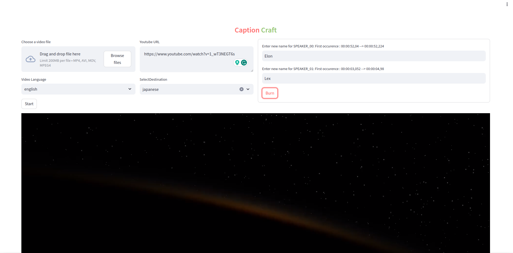

## Overview

**CaptionCraft** is an all-in-one tool designed to enhance video content with automated subtitles, speaker diarization, language translation, and more. Leveraging cutting-edge technologies like Wav2Vec and MBart, CaptionCraft extracts captions from videos, identifies different speakers, and translates subtitles into various languages. Ideal for content creators, educators, and businesses seeking to make their video content more accessible and engaging across different languages.

## Features
- **Arbitrarily long video.**: Handles video of any length. 
- **Automated Caption Extraction**: Extract captions from videos with high accuracy.
- **Speaker Diarization**: Identify and label different speakers in the video using pyannote/speaker-diarization-3.0.
- **Language Translation**: Translate captions from the source language to a variety of other languages using MBart.
- **Subtitle Burning**: Embed subtitles directly into the video for seamless viewing.
- **YouTube Integration**: Automatically download and process videos from YouTube links.


## Getting Started

### Prerequisites

Ensure you have Python installed on your system. CaptionCraft is built and tested with Python 3.x.

### Installation

1. Clone the repository:
   ```bash
   git clone https://github.com/yourusername/CaptionCraft.git
   ```
2. Navigate to the CaptionCraft directory:
   ```bash
   cd CaptionCraft
   ```
3. Create a virtual environment:
   ```bash
   python -m venv venv
   ```
4. Activate the virtual environment:
   - On Windows: `venv\Scripts\activate`
   - On Unix or MacOS: `source venv/bin/activate`
5. Install the required packages:
   ```bash
   pip install -r requirements.txt
   ```

## Usage

CaptionCraft also features an easy-to-use graphical user interface powered by Streamlit.

You will need a Huggingface token to run the diarization pipe. After generating the token place it inside ```src/config.py```.
```
c.model.HF_TOKEN = "YOUR HF TOKEN"

```

### Running the UI



Run the UI with the following command:
   ```bash
   streamlit run ui.py
   ```


### Basic Usage

```python
from captioncraft import Pipe

processor = Pipe(delete_intermediate=True)
processor(
    path="https://www.youtube.com/watch?v=w9NkqdoIH5A",
    source_language="english",
    destination_language="hindi",
)

processor.remap_speakers({"SPEAKER_01": "Lex", "SPEAKER_00": "Elon"})
processor.burn_subtitle_to_video()
```

### Parameters

- `path`: URL of the YouTube video or path to a local video file.
- `source_language`: Language of the video.
- `destination_language` (optional): Target language for the subtitles.

### Output

The processed video with subtitles, along with SRT files, will be stored in the `video` directory of your working folder.

### Notes
If you are getting this error: <br>
```code
RuntimeError: cuDNN version incompatibility: PyTorch was compiled  against (8, 9, 2) but found runtime version (8, 2, 4). PyTorch already comes bundled with cuDNN. One option to resolving this error is to ensure PyTorch can find the bundled cuDNN.Looks like your LD_LIBRARY_PATH contains incompatible version of cudnnPlease either remove it from the path or install cudnn (8, 9, 2)
```
Run followig command before running the file.
```
export LD_LIBRARY_PATH=`python3 -c 'import os; import nvidia.cublas.lib; import nvidia.cudnn.lib; print(os.path.dirname(nvidia.cublas.lib.__file__) + ":" + os.path.dirname(nvidia.cudnn.lib.__file__))'`
```

## Roadmap

- **Text-to-Speech Conversion**: Converting subtitles back to speech in various languages.
- **Enhanced Font Support**: Better font rendering for a wide range of languages.
- **Pipeline Optimization**: Streamlining the processing pipeline for efficiency and speed.

## Contributing

Contributions to improve CaptionCraft are welcome! Please read `CONTRIBUTING.md` for details on our code of conduct, and the process for submitting pull requests.

## License

This project is licensed under the MIT License - see the `LICENSE.md` file for details.

## Acknowledgments

- The pyannote.audio team for their speaker diarization toolkit.
- The developers of Wav2Vec and MBart for their amazing work in speech and language processing.
- The developers of [faster_whisper](https://github.com/SYSTRAN/faster-whisper) and [whisperx](https://github.com/m-bain/whisperX) for amazing whisper repo.
- [maximofn/subtify](https://github.com/maximofn/subtify) for few code reference.

